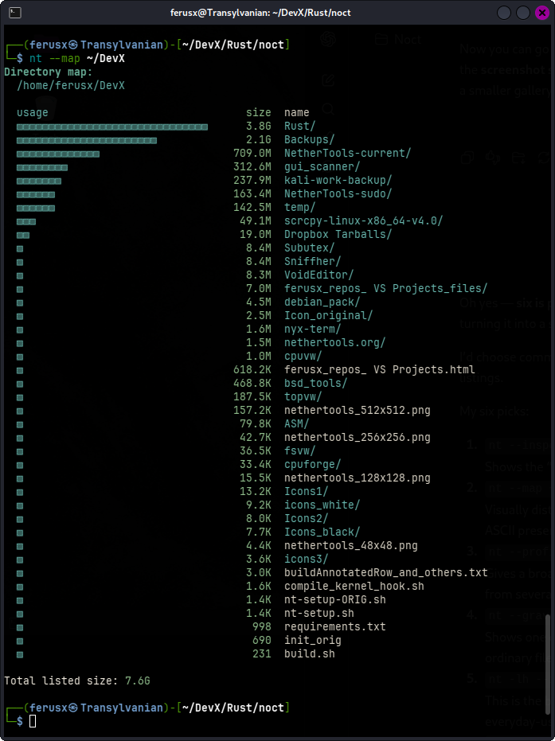
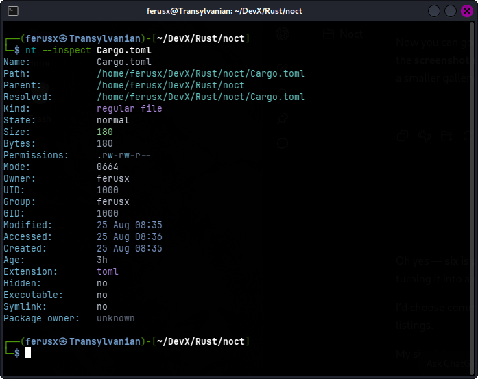
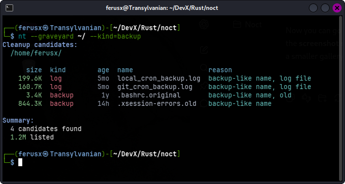
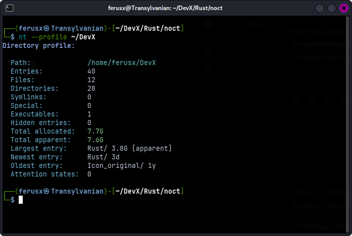
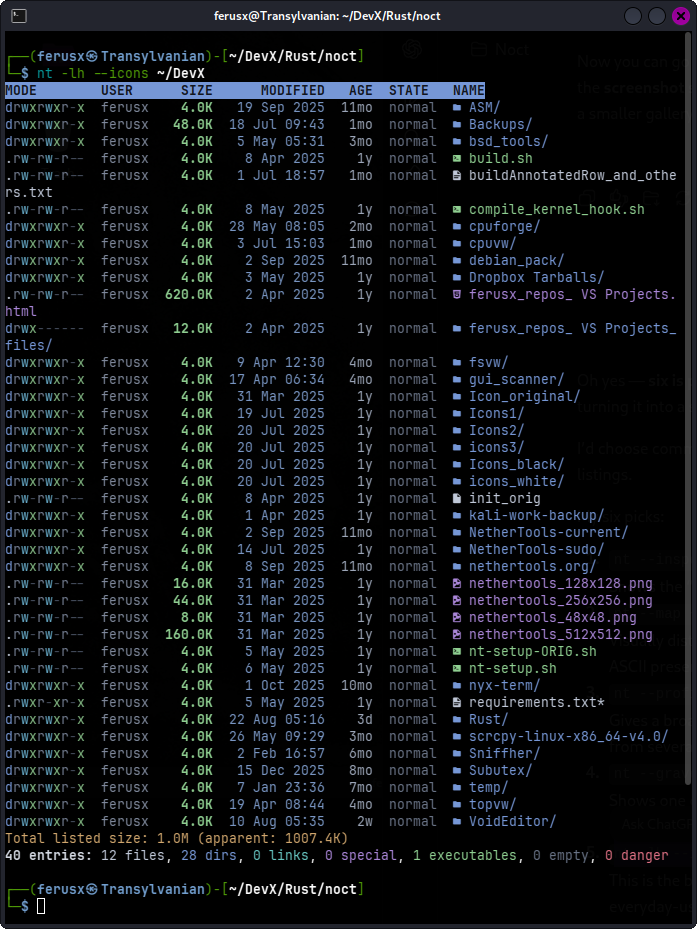
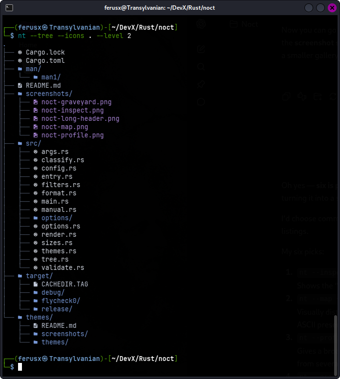

# Noct

**A command-line filesystem inspection and analysis toolkit for Unix-like systems.**

Noct is built for looking at filesystems from more useful angles than a traditional directory listing alone can provide. It combines a fast everyday file lister with focused inspection modes for ownership, permissions, age, sizes, duplicate files, scripts, extensions, filesystem boundaries, cleanup candidates, and more.

The installed executable is `noct`, while `nt` is the recommended short form used throughout this documentation.

Noct can be used as a familiar directory viewer when you simply want to see what is there, or as a more specialized inspection tool when you want the filesystem to answer a particular question.

## Highlights

- Fast grid, one-line, long, and recursive Tree views
- Rich terminal colors with configurable themes
- Optional Nerd Font file-type icons
- Filesystem-aware classification for files and directories
- Detailed long listings with permissions, owner, size, timestamps, age, and state
- Filtering by size, age, permissions, state, extension, executability, writability, and more
- Specialized modes for duplicates, ownership, permissions, scripts, extensions, cleanup candidates, directory usage, filesystem mounts, and other inspections
- Configurable sorting, limits, output width, and display behavior
- Built-in `--help`, explanatory `--manual`, theme reference with `--theme-help`, and generated configuration template support

## Screenshots


### Noct's \--map Option
`--map` gives a directory a visual size profile, making the relative weight of its contents immediately obvious. The proportional bars make large directories and files stand out without requiring you to compare a column of numbers manually.

<p align="center">
  
</p>

### Noct's \--inspect Option
`--inspect` gives one filesystem entry the full interrogation treatment. Paths, type, state, ownership, permissions, timestamps, age, extension, and other useful properties are gathered into a compact single-entry report.

<p align="center">
  
</p>

### Noct's \--graveyard Option
`--graveyard` searches for files that look like likely cleanup candidates and explains why each one was selected. Here it is narrowed to backup-related files, combining age, size, kind, and filename clues into one focused report.

<p align="center">
  
</p>

### Noct's \--profile Option
`--profile` gives a broader snapshot of a directory rather than concentrating on individual entries. It summarizes its contents, space usage, executable and hidden entries, age extremes, and other useful characteristics in one compact report.

<p align="center">
  
</p>

### Noct's \--long --header Options
`Noct's` long view turns ordinary directory browsing into a metadata-rich table with permissions, ownership, size, timestamps, age, state, and classified filenames. Optional **Nerd Font** icons and themed filesystem colors make different kinds of entries easy to distinguish at a glance.

<p align="center">
  
</p>

### Noct's \--tree Option
Tree mode provides a recursive structural view while retaining `Noct's` filesystem classification, colors, and optional icons. Depth can be restricted with `--level`, making it useful both for quick project overviews and deeper directory exploration.

<p align="center">
  
</p>

## Installation

Noct is written in Rust and currently targets Unix-like systems, with Linux and FreeBSD as its primary development and testing platforms.

### Build from source

Clone the repository and build the release binary:

```sh
git clone https://github.com/ferusx/noct.git
cd noct
cargo build --release
```

The compiled binary will be available at:

```text
target/release/noct
```

Install it somewhere in your `PATH`, for example:

```sh
sudo install -m 755 target/release/noct /usr/local/bin/noct
```

Noct's manual page is located at:

```text
man/man1/noct.1
```

It can be installed manually with:

```sh
sudo install -m 644 man/man1/noct.1 /usr/local/share/man/man1/noct.1
```

### The `nt` command

The installed executable is named `noct`, but the recommendation is to use `nt` as the preferred short command.

For Zsh or Bash, you can add an alias such as:

```sh
alias nt='noct'
```

Add it to your shell configuration if you want it available in every session.

For example:

```sh
echo "alias nt='noct'" >> ~/.zshrc
```

or:

```sh
echo "alias nt='noct'" >> ~/.bashrc
```

Reload the shell configuration or start a new shell afterwards.

## Quick Start

Noct is designed to make useful filesystem inspection accessible without requiring you to assemble several separate commands first. Many of its inspection modes can be used directly: choose what you want to know, point Noct at a path, and let it build the report.

List the current directory:

```
nt
```

List the current directory using Noct's long format, similar in spirit to **`ls -l`**:

```
nt -l
```

Take a detailed look at one entry:

```
nt --inspect Cargo.toml
```

Get a broader profile of a directory:

```
nt --profile ~/Projects
```

Map the filesystem characteristics of a path using a graphical ASCII layout:

```
nt --map ~/
```

Find duplicate files:

```
nt --duplicates ~/Downloads
```

Look for likely cleanup candidates:

```
nt --graveyard ~/
```

Or switch back to familiar filesystem browsing with a recursive Tree:

```
nt --tree ~/Projects
```

These are only a few of Noct's many inspection modes. Most are deliberately simple to invoke, while additional modifiers and different combinations are available when you want to narrow or reshape a report.

## Inspection Tools

Noct's inspection modes are designed to answer useful filesystem questions directly. Instead of assembling several separate commands, you can usually point Noct at a path and ask for the kind of report you want.

Some of the many useful inspection modes are:

| Option | Purpose |
|---|---|
| `--inspect` | Examine one filesystem entry in detail |
| `--duplicates` | Find duplicate regular files |
| `--graveyard` | Find likely cleanup candidates |
| `--names` | Analyze filenames and naming patterns |
| `--map` | Show a graphical ASCII map of filesystem characteristics |
| `--profile` | Build a broader profile of a directory |
| `--perms` | Summarize permission modes |
| `--owners` | Summarize ownership |
| `--hot` | Find recently modified files |
| `--cold` | Find older files |

A few examples:

```sh
nt --inspect Cargo.toml
```

```sh
nt --duplicates ~/Downloads
```

```sh
nt --graveyard ~/ --kind=backup
```

```sh
nt --names ~/Projects
```

```sh
nt --map ~/
```

```sh
nt --profile ~/Projects
```

```sh
nt --owners ~/Projects
```

Many inspection modes also accept focused modifiers for things such as age, size, sorting, recursion, limits, or report-specific fields.

For the complete set of inspection modes and their available modifiers, use:

```sh
nt --help
```

or open the explanatory built-in manual:

```sh
nt --manual
```

## Listing and Tree Views

Noct can also be used as a fast everyday directory viewer. Ordinary listings support familiar grid and long formats, while Tree mode gives a recursive structural view of a path.

### Ordinary Listings

Run Noct without a specialized inspection mode to list a directory:

```sh
nt ~/Downloads
```

Use long format for a metadata-rich view:

```sh
nt -l ~/Downloads
```

Add headings when you want the columns labeled:

```sh
nt -lh ~/Projects
```

Hidden entries, sorting, filtering, output width, icons, and individual long-view columns can all be controlled when needed.

### Tree View

Use Tree mode when the directory structure itself is what you want to inspect:

```sh
nt --tree ~/Projects
```

Limit how deeply the Tree expands:

```sh
nt --tree ~/Projects --level 3
```

Or show directories only:

```sh
nt --tree ~/Projects -D
```

Tree output shares Noct's filesystem classification, colors, icons, sorting, and hidden-entry handling, so it remains visually consistent with ordinary listings.

For the full set of display and Tree options, see:

```sh
nt --help
```

## Filtering and Sorting

Noct's ordinary listings can be narrowed and reordered without leaving the command. Filters can focus the view on things such as size, age, permissions, state, executability, or file extension, while sorting controls how the final results are presented.

Common filters include:

- size: `--big`, `--tiny`, `--greater-than`, `--less-than`
- age: `--fresh`, `--stale`, `--newer-than`, `--older-than`
- state: `--danger`, `--orphans`, `--only-state`
- permissions: `--writable`, `--world-writable`, `--suid`, `--sgid`, `--permissions`
- file type and role: `--executables`, `--empty`, `--filter`

For example, find large files:

```sh
nt --big ~/Downloads
```

Find entries modified within the last week:

```sh
nt --newer-than 7d ~/Projects
```

Filter Rust source files:

```sh
nt -f ext rs ~/Projects
```

Filter by filesystem type:

```
nt -lh -f type directory ~/Projects
```

Sorting is available through `--sort` or `-s`, with ordinary listing fields such as:

- `name`
- `size`
- `age`
- `date`
- `extension`

For example:

```sh
nt -l ~/Downloads --sort size
```

The `date` field follows the timestamp selected with `-t, --time`. For example, to show and sort by creation time:

```sh
nt -lh ~/Projects -t created --sort date
```

You can also reverse the selected order with `--reverse`, or preserve filesystem directory order with `--unsorted`.

Specialized inspection modes may provide their own filters, modifiers, and sort fields. The complete combinations are documented in:

```sh
nt --help
```

and:

```sh
nt --manual
```

## Configuration, Themes, Colors, and Icons

Noct can be customized through its configuration file, including default listing behavior, long-view columns, sorting, colors, icons, and themes.

The configuration is stored under Noct's XDG configuration directory, normally:

```text
~/.config/noct/noct.toml
```

Rather than building a configuration file by hand, Noct can generate a fully commented template:

```sh
nt --generate-config
```

The generated copy is written separately from the active configuration, so it can be reviewed and edited before replacing the current settings.

### Themes

Noct supports external color themes stored under:

```text
~/.config/noct/themes/
```

Select a theme in `noct.toml`:

```toml
theme = "jungle"
```

Themes can control colors throughout Noct's listings, reports, headers, summaries, permissions, filesystem classifications, and other interface elements.

For a focused explanation of the theming system, use:

```sh
nt --theme-help
```

### Filesystem Colors

Filename and icon coloring can be controlled independently of the rest of the interface with:

```toml
filesystem_colors = "theme"
```

Noct provides three filesystem color modes:

- `theme` — use filesystem classification colors from the selected theme
- `standard` — use Noct's built-in filesystem classification palette
- `directories` — emphasize directory coloring while leaving ordinary filenames unclassified

This makes it possible to use anything from rich file classification to a much quieter traditional directory-oriented appearance.

### Icons

Nerd Font file-type icons can be enabled in the configuration:

```toml
[display]
icons = true
```

or for an individual command:

```sh
nt --icons ~/Projects
```

Icons use the same filesystem classification system as filenames and are available in ordinary listings as well as Tree view.

A font containing the required Nerd Font glyph must be installed for the icons to display correctly.

## Documentation

Noct includes several layers of built-in documentation depending on how much detail you need.

For a compact command reference:

```sh
nt --help
```

For the full explanatory built-in manual:

```sh
nt --manual
```

For the installed system manual page:

```sh
man noct
```

For configuration and theme-specific guidance:

```sh
nt --generate-config
```

```sh
nt --theme-help
```

The README is intended as an introduction and overview. The built-in help, manual, generated configuration, and man page contain the complete option reference and mode-specific details.

## Platforms

Noct is developed for Unix-like systems and is currently tested primarily on Linux and FreeBSD.

### Linux

Noct works as a native command-line tool on Linux and integrates naturally with standard Unix filesystem conventions, permissions, ownership, symbolic links, and terminal environments.

Build from source with Cargo:

```sh
cargo build --release
```

### FreeBSD

FreeBSD is also a primary development and testing platform for Noct.

Noct supports FreeBSD filesystem and package-management workflows, including package ownership inspection where the required system tools are available.

A FreeBSD port is planned for installation through the Ports Collection and packages. Until that release is available, Noct can be built from source with Cargo in the same way as on Linux.

### Terminal Support

Noct is designed for terminal use and works with plain text output as well as rich ANSI colors.

Optional file-type icons require a Nerd Font-compatible terminal font.

Color output is automatically suppressed for non-interactive output when appropriate, and can also be disabled explicitly with:

```sh
nt --no-colors
```

## Scry

Noct is developed alongside [Scry](https://github.com/ferusx/scry-tui-file-browser), an interactive terminal file search and navigation tool.

The two projects share some visual ideas and filesystem-oriented design, but they serve different purposes:

- **Noct** is primarily a command-line inspection and analysis tool
- **Scry** is an interactive TUI for searching, browsing, and navigating filesystems

They can be used independently, but together they cover two different sides of filesystem work: inspecting what is there and interactively finding your way through it.

## License

Noct is released under the BSD 3-Clause License.

See [LICENSE](LICENSE) for the full license text.